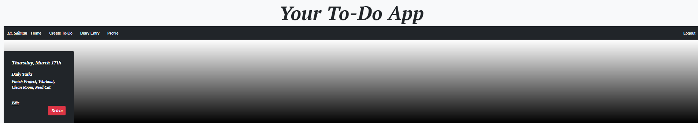
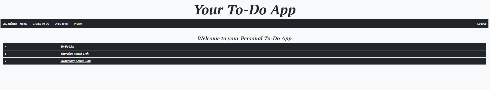

Your To Do App

Welcome to your to-do list App!

Use this app to note down all your to-do's from your day-to-day life, all while keeping them private by logging in!

This app was created because I wanted a place for myself to keep track of my daily tasks, all while keeping them private.

Sign up and log in and create your first to-do!

Screenshots

---

---

---
---

Technologies Used 

- HTML
- CSS
- JavaScript
- Node.js
- Express
- MongoDB
- Passport
- Heroku
- Multer
- Connect Flash

Link to App

### [Your To-Do App](https://todolistappsei48.herokuapp.com/)

Future Enhancements

- Allow users to add diary entries.
- Allow users to edit, and delete diary entries.
- Allow users to search for their entries.
- Styling upgrades for home page and profile page.